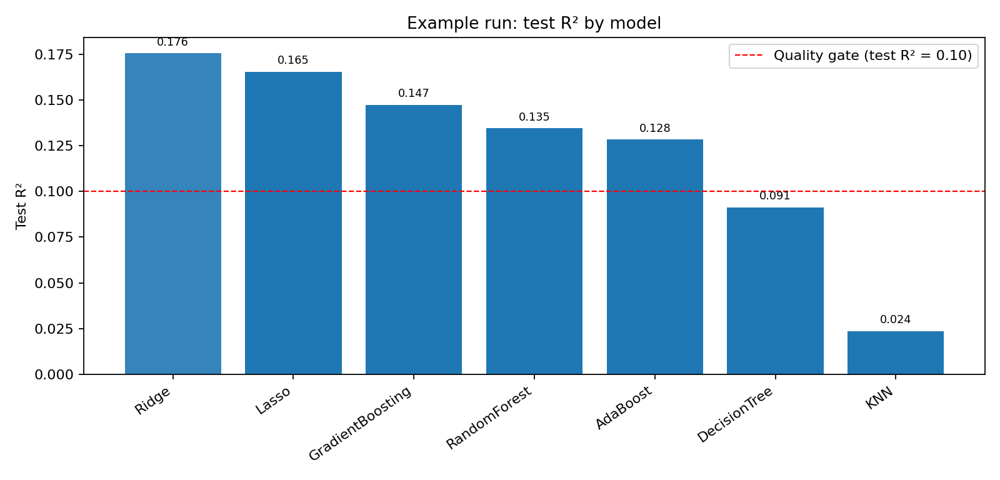

# 🎓 Student Performance Predictor — End-to-End MLOps

[](https://github.com/Ishtiaque-h/student-performance-indicator/actions/workflows/ci.yml)
[](https://github.com/Ishtiaque-h/student-performance-indicator/actions/workflows/deploy.yml)
[](https://github.com/Ishtiaque-h/student-performance-indicator/actions/workflows/cd-cloudrun.yml)
[](https://github.com/Ishtiaque-h/student-performance-indicator/actions/workflows/retrain.yml)
[](https://www.python.org/downloads/)

An end-to-end ML system that classifies student `who needs support` from enrollment-time attributes, with reproducible training, staged deployment, and artifact promotion. **Monitoring is being added as part of the next phase of development.**

🔗 **Live API**: https://student-performance-api-654581958038.us-central1.run.app

---

## 1) Problem framing and deployment context

This pre-exam/ enrollment early warning system performs risk-first classification and performance band prediction with optional math score estimate as secondary to support **early academic-risk screening**.  
It is a **predictive** model aligned with real decisions - `who needs help?`, not a causal estimator, and should not be interpreted as proving why outcomes happen. Better suited to limited feature signal in this dataset.

- **Objective:** risk classification + performance bands (primary), with optional score estimate as secondary. from pre-exam attributes available at enrollment.
- **Decision context:** support early intervention planning (high-risk students first), not final grading or disciplinary actions. Math underperformance also signals high-risk students.
- **Governance:** fairness checks by subgroup, strict anti-leakage feature policy, periodic retraining with drift checks
- **Data source:** [Students Performance in Exams (Kaggle)](https://www.kaggle.com/datasets/spscientist/students-performance-in-exams)

### Serving feature set (enrollment-time):
- `gender`
- `race_ethnicity`
- `parental_level_of_education`
- `lunch`
- `test_preparation_course`

### Prediction outputs (assessment layer)
Primarily, the prediction pipeline computes:
- `score_range`: bounded uncertainty interval around prediction (MAE-based)
- `performance_band`: low/medium/high band from configured score cutoffs
- `risk_probability`: smooth risk score around the configured risk threshold
- `risk_tier`: low/medium/high operational risk tier from probability thresholds
- `score_prediction`: math score (0-100) is also estimated as secondary.

### Default operational thresholds (from `CONFIG.product`):
- `risk_threshold_score = 50.0`
- `risk_probability_scale = 10.0`
- `risk_tier_medium_min = 0.40`
- `risk_tier_high_min = 0.70`
- `performance_band_low_max = 50.0`
- `performance_band_medium_max = 70.0`

---

## 2) Feature policy and leakage control

`reading_score` and `writing_score` are intentionally excluded because they are same-sitting outcomes with `math_score`, not enrollment-time inputs.

- Config-level policy: `CONFIG.dataset.drop_cols = ["reading_score", "writing_score"]`
- Training path applies this drop policy before fitting
- Prediction path also drops these columns if provided accidentally

If leakage features were included, performance would look much higher, but that uplift would be non-deployable and misleading for the real enrollment-time use case.

---

## 3) EDA findings that drive model design

EDA reference: [`notebooks/EDA_student_performance.ipynb`](./notebooks/EDA_student_performance.ipynb)

Decision-useful (deployable) observations:
- **Lunch effect is very strong:** mean math score gap is ~11 points (standard ≈ 70.0 vs free/reduced ≈ 58.9).
- **Test-preparation completion aligns with improved math outcomes:** completed prep gives ~5–7 point mean lift (larger lift in free/reduced subgroup).
- **Risk segmentation insight:** low-math rate (<50) is much higher in free/reduced lunch (~27%) vs standard (~6%).
- Parental education level and group-level patterns provide usable pre-exam signal.

Diagnostic-only observation:
- math has strong correlation with reading/writing, but those are **not serving features** due to leakage risk.
- reading/writing correlate strongly with math (r ≈ 0.82, w ≈ 0.80) — supports excluding them in deploy-time modeling.

---

## 4) Modeling/evaluation and metric interpretation

Training notebook: [`notebooks/model_training.ipynb`](./notebooks/model_training.ipynb)

Model family comparison includes baseline, linear, tree, ensemble, and optional boosted models.  
Given only five categorical pre-exam features, **moderate** predictive strength is expected; simpler linear models can be competitive and easier to interpret/operate.

Selection principle:
- CV-first model selection (5-fold `r2`)
- holdout test metrics for final reporting (`R²`, `MAE`, `RMSE`)

### Results snapshot (example run)
- Best model (CV-selected): Lasso
- CV R²: 0.244
- Test R²: 0.165
- Test MAE: 11.364
- Test RMSE: 14.251
- Quality gate (`test_r2 >= 0.10`): pass



Detailed metrics artifact: [`docs/results/model_report_example.json`](./docs/results/model_report_example.json)

### Metric meaning for stakeholders
- **R²:** share of score variance explained versus mean-only prediction
- **MAE:** average absolute error in score points (typical miss size)
- **RMSE:** error magnitude with stronger penalty for larger misses

Quality gate rationale (`test_r2 >= 0.10`): With only 5 categorical enrollment-time features, predictive signal is real but limited. Moderate R² is expected. This project rejects weak candidates while staying realistic about the information available at inference time.

---

## 5) Artifact contract and serving behavior

Required serving artifacts:
- `pipeline.pkl`
- `model_report.json`
- `ingestion_meta.json`

`pipeline.pkl` is the primary inference artifact, keeping preprocessing + model coupled to prevent train/serve skew.

Reliability implications:
- reproducible deployment from immutable run artifacts
- safer rollback by switching promoted artifact URI
- no production retraining during deploy

---

## 7) API validation and reliability

Core endpoints:
- `GET /health`
- `GET /schema`
- `GET /meta`
- `GET /model_info`
- `POST /predict`
- `POST /predict_batch`

Validation as ML input-quality control:
- required-field enforcement
- unknown-field rejection
- normalization (`strip + lowercase`)
- null/empty rejection
- category membership checks from trained encoder categories
- optional numeric range guards from config

Strict rejection on invalid inputs improves serving reliability by preventing silent schema drift and nonsensical predictions.

Assessment logic for `score_range`, `performance_band`, `risk_probability`, and `risk_tier` is implemented in the prediction pipeline and controlled by product thresholds in config.

---

## 8) MLOps lifecycle (CI/CD/retrain/promotion)

Shared ML contract across cloud targets: train candidate → evaluate/gate → publish/promote artifact pointer → deploy serving app with promoted artifact URI (`gs://...` or `s3://...`).

Lifecycle:
1. Train candidate and produce artifacts
2. Evaluate and apply quality gate
3. Publish run-indexed artifacts
4. Update promotion pointer (`promoted/latest_uri.txt`) on pass
5. Deploy production from promoted artifact (not from fresh retraining)

Workflow governance view:
- `ci.yml`: proves code quality and smoke-level functional integrity on change
- `deploy.yml`: proves staging deploy from a run-specific candidate artifact
- `retrain.yml`: proves scheduled/manual retrain + gating + promotion pointer update
- `cd-cloudrun.yml`: proves production deploy consumes promoted pointer and validates required artifacts
- release tag convention: use `v*` for GCP production CD and `aws-v*` for AWS production CD

AWS deployment variant is maintained in branch `aws-deployment`, while this branch contains the GCP workflow files above; both follow the same artifact/promotion contract.

---

## 8a) AWS Free Tier deployment guide (stakeholder demo)

### Cost analysis of existing ECS Fargate approach

The `deploy-aws.yml` workflow deploys to **ECS Fargate + Application Load Balancer**, which are **not** covered by the AWS Free Tier:

| Service | Monthly cost | Free tier? |
|---|---|---|
| Application Load Balancer | ~$16/month minimum | ❌ No |
| ECS Fargate (0.25 vCPU + 0.5 GB, always-on) | ~$7-15/month | ❌ No |
| ECR (≤500 MB images) | Free | ✅ First 12 months |
| S3 (≤5 GB artifacts) | Free | ✅ First 12 months |
| **Total (ECS+ALB)** | **~$23-31/month** | |

### Recommended free-tier path: AWS App Runner

**AWS App Runner** (`deploy-apprunner.yml`) eliminates the ALB entirely. App Runner provides its own stable HTTPS endpoint at no extra cost:

| Service | Monthly cost (demo-level traffic) | Free tier? |
|---|---|---|
| App Runner compute (0.25 vCPU + 0.5 GB, auto-paused) | ~$0-5/month | ⚠️ No standalone free tier, but auto-pause reduces cost to near zero between visits |
| ECR (≤500 MB images) | Free | ✅ First 12 months |
| S3 (≤5 GB artifacts) | Free | ✅ First 12 months |
| **Total (App Runner)** | **~$0-5/month** | |

App Runner **auto-pauses** the container when no requests arrive for a configured idle period, meaning you are only charged for actual compute time. For a stakeholder demo with a few visits per day the bill is typically under $3/month.

The stable public URL format is:
```
https://<random-id>.<region>.awsapprunner.com
```
This URL **persists** unless you delete and recreate the service.

### Required one-time AWS setup

**1. ECR repository**
```bash
aws ecr create-repository --repository-name student-performance --region us-east-1
```

**2. S3 bucket for model artifacts**
```bash
aws s3 mb s3://your-bucket-name --region us-east-1
```

**3. IAM role for App Runner to pull from ECR**

App Runner needs an access role with the managed policy `AWSAppRunnerServicePolicyForECRAccess`:
```bash
# Create the trust policy document
cat > /tmp/apprunner-trust.json <<'EOF'
{
  "Version": "2012-10-17",
  "Statement": [{
    "Effect": "Allow",
    "Principal": {"Service": "build.apprunner.amazonaws.com"},
    "Action": "sts:AssumeRole"
  }]
}
EOF

aws iam create-role \
  --role-name AppRunnerECRAccessRole \
  --assume-role-policy-document file:///tmp/apprunner-trust.json

aws iam attach-role-policy \
  --role-name AppRunnerECRAccessRole \
  --policy-arn arn:aws:iam::aws:policy/service-role/AWSAppRunnerServicePolicyForECRAccess
```

**4. IAM role for GitHub Actions (OIDC)**

Create an IAM role that GitHub Actions can assume via OIDC. Attach these policies:
- `AmazonEC2ContainerRegistryPowerUser` — push images to ECR
- `AmazonAppRunnerFullAccess` — create/update App Runner services
- `AmazonS3FullAccess` (or a scoped policy on your bucket) — read/write model artifacts

**5. GitHub Actions repository variables** (`Settings → Secrets and variables → Actions → Variables`)

| Variable | Example value |
|---|---|
| `AWS_REGION` | `us-east-1` |
| `ECR_REPOSITORY` | `student-performance` |
| `APPRUNNER_SERVICE_NAME` | `student-performance-api` |
| `MODEL_REGISTRY_URI` | `s3://your-bucket-name/student-performance` |

**GitHub Actions secret:**

| Secret | Value |
|---|---|
| `AWS_IAM_ROLE_ARN` | `arn:aws:iam::<ACCOUNT_ID>:role/<GitHubActionsRole>` |

### Deploying

Push any commit to the `aws-deployment` branch (or trigger manually from the Actions tab):
```bash
git push origin aws-deployment
```

The `deploy-apprunner.yml` workflow will:
1. Train and publish model artifacts to S3
2. Build a Docker image and push it to ECR
3. Create the App Runner service (first run) or update it (subsequent runs)
4. Wait for the service to reach `RUNNING` state
5. Run a post-deploy smoke test against `/health` and `/predict`
6. Print the stable public URL

### Monitoring

App Runner emits metrics to **CloudWatch** automatically (no extra setup). Key metrics:

| Metric | What to watch for |
|---|---|
| `ActiveInstances` | Should be ≥1 after first request; 0 = paused (normal when idle) |
| `RequestLatency` | Spikes may indicate model loading on cold start |
| `5xxError` | Elevated rate signals application errors |
| `HttpStatusCode4xx` | High rate may indicate client-side schema issues |

Free CloudWatch allowance (always free): 10 custom metrics + 10 alarms.

To set up a simple cost alarm (recommended):
```bash
aws cloudwatch put-metric-alarm \
  --alarm-name "AppRunnerMonthlyCostGuard" \
  --namespace "AWS/Billing" \
  --metric-name EstimatedCharges \
  --dimensions Name=ServiceName,Value=AWSAppRunner \
  --statistic Maximum \
  --period 86400 \
  --threshold 10 \
  --comparison-operator GreaterThanThreshold \
  --evaluation-periods 1 \
  --alarm-actions arn:aws:sns:<region>:<account>:your-topic
```

### Rollback

App Runner does not keep previous image versions active, but ECR images are tagged by git SHA. To roll back:

1. Find the previous working image tag from the ECR console or:
   ```bash
   aws ecr describe-images --repository-name student-performance \
     --query 'sort_by(imageDetails,&imagePushedAt)[-5:].imageTags' --output table
   ```
2. Update the App Runner service to that image:
   ```bash
   SERVICE_ARN=$(aws apprunner list-services \
     --query "ServiceSummaryList[?ServiceName=='student-performance-api'].ServiceArn" \
     --output text)

   aws apprunner update-service \
     --service-arn "${SERVICE_ARN}" \
     --source-configuration "{
       \"ImageRepository\": {
         \"ImageIdentifier\": \"<ACCOUNT>.dkr.ecr.<REGION>.amazonaws.com/student-performance:<PREV_SHA>\",
         \"ImageConfiguration\": {\"Port\": \"8080\"},
         \"ImageRepositoryType\": \"ECR\"
       },
       \"AuthenticationConfiguration\": {
         \"AccessRoleArn\": \"arn:aws:iam::<ACCOUNT>:role/AppRunnerECRAccessRole\"
       },
       \"AutoDeploymentsEnabled\": false
     }"
   ```
3. Wait for the service to return to `RUNNING` state, then verify `/health`.

### Workflow file reference

| Workflow | Purpose | Free tier? |
|---|---|---|
| `deploy-apprunner.yml` | **Recommended demo** — App Runner, no ALB, auto-pause | ✅ ~$0–5/month |
| `deploy-aws.yml` | ECS Fargate + ALB (full staging/production) | ❌ ~$23–31/month |
| `cd-aws.yml` | ECS Fargate production CD (triggered by `aws-v*` tag) | ❌ Paid |
| `retrain-aws.yml` | Scheduled retrain + artifact promotion on AWS | depends on compute |

---

## 9) Limitations, ethics, and future work

- Uses demographic/proxy features; subgroup fairness risks must be assessed before operational use.
- Not for high-stakes automated decisions (discipline, admissions, punitive actions).
- Predictive outputs should support human-in-the-loop triage, not replace educators.
- **Next phase of ongoing development:** subgroup fairness analysis, drift monitoring, post-deploy performance tracking/calibration.

---

## 10) Quickstart + verification commands

### Local setup
```bash
git clone https://github.com/Ishtiaque-h/student-performance-indicator.git
cd student-performance-indicator
python -m venv .venv
source .venv/bin/activate  # Windows: .venv\Scripts\activate
pip install -e ".[all]"
```

### Train locally
```bash
python scripts/train_and_publish.py \
  --registry-uri <gs://YOUR-BUCKET/student-performance or s3://YOUR-BUCKET/student-performance> \
  --index-latest
```

### Run API locally
```bash
uvicorn student_performance.api:app --reload --port 8000
curl http://localhost:8000/health
```

### Example prediction
```bash
curl -X POST http://localhost:8000/predict \
  -H "Content-Type: application/json" \
  -d '{
    "gender": "female",
    "race_ethnicity": "group B",
    "parental_level_of_education": "bachelor'\''s degree",
    "lunch": "standard",
    "test_preparation_course": "none"
  }'
```

### Verification commands (repo root)

```bash
ruff check src tests scripts
black --check src tests scripts
pytest -m smoke -q
python -m pytest -q
```

---

## 11) Evidence map

| README claim | Evidence |
|---|---|
| Enrollment-time objective and leakage-aware feature policy | [`src/student_performance/components/config.py`](./src/student_performance/components/config.py) |
| Leak columns dropped in train and serve paths | [`src/student_performance/components/data_transformation.py`](./src/student_performance/components/data_transformation.py), [`src/student_performance/pipeline/predict_pipeline.py`](./src/student_performance/pipeline/predict_pipeline.py) |
| Enriched prediction outputs (`score_range`, `performance_band`, `risk_probability`, `risk_tier`) | [`src/student_performance/pipeline/predict_pipeline.py`](./src/student_performance/pipeline/predict_pipeline.py), [`src/student_performance/components/config.py`](./src/student_performance/components/config.py) |
| Pipeline-first serving + required artifacts | [`src/student_performance/pipeline/predict_pipeline.py`](./src/student_performance/pipeline/predict_pipeline.py) |
| API validation behavior | [`src/student_performance/api.py`](./src/student_performance/api.py), [`tests/test_api_validation.py`](./tests/test_api_validation.py) |
| CV-first model selection configuration | [`src/student_performance/components/config.py`](./src/student_performance/components/config.py), [`src/student_performance/modeling.py`](./src/student_performance/modeling.py) |
| Candidate training and artifact generation | [`src/student_performance/pipeline/train_pipeline.py`](./src/student_performance/pipeline/train_pipeline.py), [`scripts/train_and_publish.py`](./scripts/train_and_publish.py) |
| CI quality checks | [`.github/workflows/ci.yml`](./.github/workflows/ci.yml) |
| Staging candidate train/deploy flow | [`.github/workflows/deploy.yml`](./.github/workflows/deploy.yml) |
| Retrain, gate, promote pointer | [`.github/workflows/retrain.yml`](./.github/workflows/retrain.yml) |
| Production deploy from promoted pointer | [`.github/workflows/cd-cloudrun.yml`](./.github/workflows/cd-cloudrun.yml) |
| AWS Free Tier demo deployment (App Runner) | [`.github/workflows/deploy-apprunner.yml`](./.github/workflows/deploy-apprunner.yml) |
| EDA interpretation support | [`notebooks/EDA_student_performance.ipynb`](./notebooks/EDA_student_performance.ipynb) |
| Model training analysis support | [`notebooks/model_training.ipynb`](./notebooks/model_training.ipynb) |

### Minimum reproducible run path
1. Train and publish locally:
   `python scripts/train_and_publish.py --registry-uri <gs://... or s3://...> --index-latest`
2. Inspect generated report:
   `artifacts/model_report.json`
3. Start API:
   `uvicorn student_performance.api:app --reload --port 8000`
4. Send a prediction request:
   `POST /predict` with the five enrollment-time features

---

## Acknowledgement

AI tools (Claude, GitHub Copilot) were used ethically for project design, analysis, and documentation.

---

## License
MIT — see [LICENSE](LICENSE)

---

## Author

Md Ishtiaque Hossain \
MSc, Computer and Information Sciences \
University of Delaware \
[LinkedIn](https://linkedin.com/in/ishtiaque-h) · [GitHub](https://github.com/Ishtiaque-h)